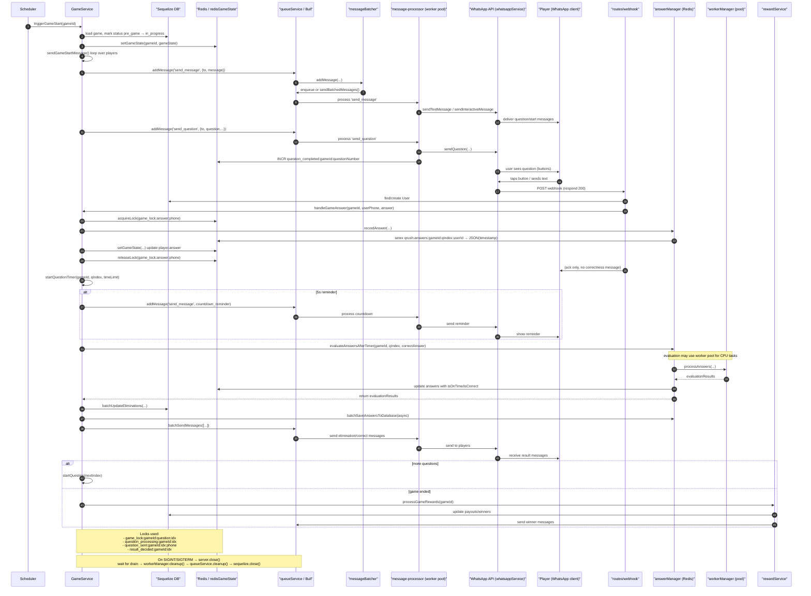

#

```mermaid
sequenceDiagram
  autonumber
  participant Scheduler
  participant GameService
  participant DB as "Sequelize DB"
  participant Redis as "Redis / redisGameState"
  participant Queue as "queueService / Bull"
  participant Batcher as "messageBatcher"
  participant MsgWorker as "message-processor (worker pool)"
  participant WhatsApp as "WhatsApp API (whatsappService)"
  participant Player as "Player (WhatsApp client)"
  participant Webhook as "routes/webhook"
  participant AnswerMgr as "answerManager (Redis)"
  participant WorkerPool as "workerManager (pool)"
  participant Reward as "rewardService"

  %% Game start path
  Scheduler->>GameService: triggerGameStart(gameId)
  GameService->>DB: load game, mark status pre_game → in_progress
  GameService->>Redis: setGameState(gameId, gameState)
  GameService->>GameService: sendGameStartMessage() loop over players
  GameService->>Queue: addMessage('send_message', {to, message})
  Queue->>Batcher: addMessage(...)
  Batcher->>Queue: enqueue or sendBatchedMessages()
  Queue->>MsgWorker: process 'send_message'
  MsgWorker->>WhatsApp: sendTextMessage / sendInteractiveMessage
  WhatsApp->>Player: deliver question/start messages

  %% Question sending & delivery
  GameService->>Queue: addMessage('send_question', {to, question,...})
  Queue->>MsgWorker: process 'send_question'
  MsgWorker->>WhatsApp: sendQuestion(...)
  MsgWorker->>Redis: INCR question_completed:gameId:questionNumber
  WhatsApp->>Player: user sees question (buttons)

  %% Player answers via webhook
  Player->>WhatsApp: taps button / sends text
  WhatsApp->>Webhook: POST webhook (respond 200)
  Webhook->>DB: find/create User
  Webhook->>GameService: handleGameAnswer(gameId, userPhone, answer)

  %% Fast record path
  GameService->>Redis: acquireLock(game_lock:answer:phone)
  GameService->>AnswerMgr: recordAnswer(...)
  AnswerMgr->>Redis: setex qrush:answers:gameId:qIndex:userId → JSON(timestamp)
  GameService->>Redis: setGameState(...) update player.answer
  GameService->>Redis: releaseLock(game_lock:answer:phone)
  Webhook->>Player: (ack only, no correctness message)

  %% Timer and timeout
  GameService->>GameService: startQuestionTimer(gameId, qIndex, timeLimit)
  alt 5s reminder
    GameService->>Queue: addMessage('send_message', countdown_reminder)
    Queue->>MsgWorker: process countdown
    MsgWorker->>WhatsApp: send reminder
    WhatsApp->>Player: show reminder
  end

  %% Timer expiry -> evaluation
  GameService->>AnswerMgr: evaluateAnswersAfterTimer(gameId, qIndex, correctAnswer)
  Note over AnswerMgr, WorkerPool: evaluation may use worker pool for CPU tasks
  AnswerMgr->>WorkerPool: processAnswers(...)
  WorkerPool-->>AnswerMgr: evaluationResults
  AnswerMgr->>Redis: update answers with isOnTime/isCorrect
  AnswerMgr-->>GameService: return evaluationResults

  %% Process evaluation results
  GameService->>DB: batchUpdateEliminations(...)
  GameService->>AnswerMgr: batchSaveAnswersToDatabase(async)
  GameService->>Queue: batchSendMessages([...])
  Queue->>MsgWorker: send elimination/correct messages
  MsgWorker->>WhatsApp: send to players
  WhatsApp->>Player: receive result messages

  %% Continue or end game
  alt more questions
    GameService->>GameService: startQuestion(nextIndex)
  else game ended
    GameService->>Reward: processGameRewards(gameId)
    Reward->>DB: update payouts/winners
    Reward->>Queue: send winner messages
  end

  %% Locks and cleanup
  Note over GameService, Redis: Locks used:<br/>- game_lock:gameId:question:idx<br/>- question_processing:gameId:idx<br/>- question_sent:gameId:idx:phone<br/>- result_decided:gameId:idx
  Note over GameService, Queue: On SIGINT/SIGTERM → server.close()<br/>wait for drain → workerManager.cleanup() → queueService.cleanup() → sequelize.close()
```
